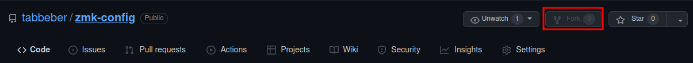
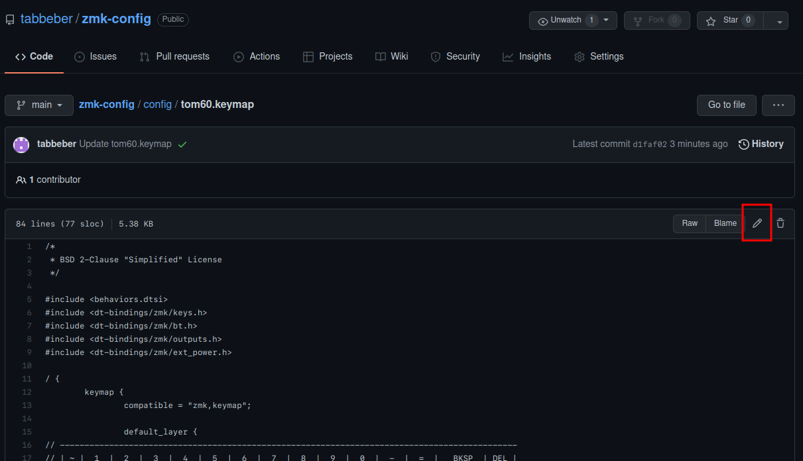
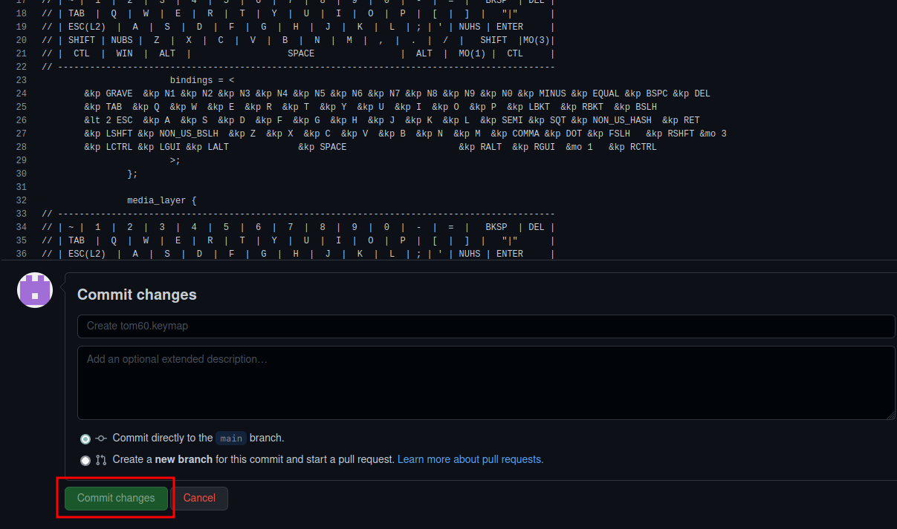
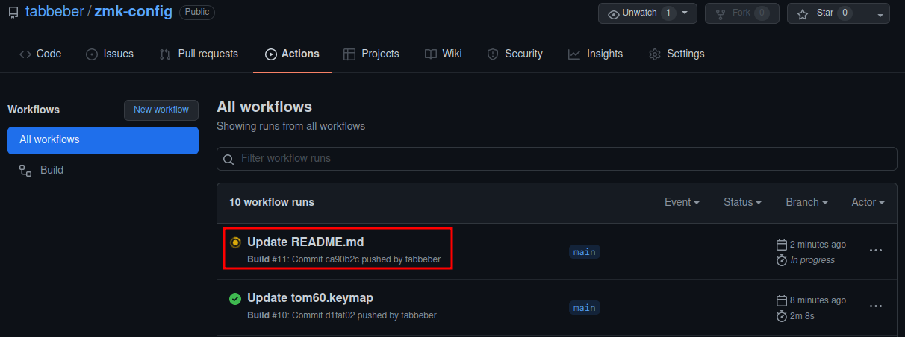
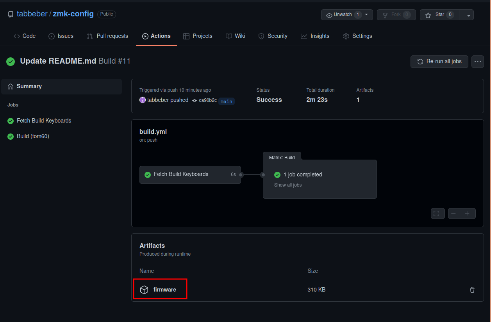

# Forkable config repository for the tom60 PCB
How to use:
* Fork this repository using the "fork" button in the top right of this web page.

* Head over to your fork of this repository.
* Do desired keymap changes in config/tom60.keymap in accordance with https://zmk.dev/docs/codes  

* Commit changes in the bottom of the web page.

* Head over to the "Actions tab".

  * Wait for the build to finish.
  
* Click on the build job and download the resulting firmware.zip under "artifacts".

* Extract the uf2-file from the zip.
* Reset the keyboard either by double pressing the reset button or hitting &reset (default MO(3) + R).
* Copy the uf2-file to the keyboard.
