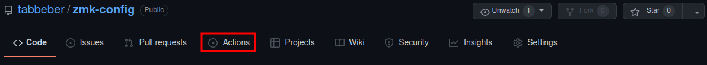

# Forkable config repository for the tom60 PCB
How to use:

Instructions with images below.

1. Fork this repository using the "fork" button in the top right of this web page.
2. Head over to your fork of this repository.
3. Do desired keymap changes in config/tom60.keymap in accordance with https://zmk.dev/docs/codes  
4. Commit changes in the bottom of the web page.
5. Head over to the "Actions tab".
  * Wait for the build to finish.
6. Click on the build job and download the resulting firmware.zip under "artifacts".
7. Extract the uf2-file from the zip.
8. Reset the keyboard either by double pressing the reset button underneath the PCB or by hitting &boot (default MO(3) + B).
9. Copy the uf2-file to the keyboard.

## With images:

1. Fork this repository using the "fork" button in the top right of this web page.

2. Head over to your fork of this repository.
3. Do desired keymap changes in config/tom60.keymap in accordance with https://zmk.dev/docs/codes  

4. Commit changes in the bottom of the web page.

5. Head over to the "Actions tab".

  * Wait for the build to finish.
  
6. Click on the build job and download the resulting firmware.zip under "artifacts".

7. Extract the uf2-file from the zip.
8. Reset the keyboard either by double pressing the reset button underneath the PCB or by hitting &boot (default MO(3) + B).
9. Copy the uf2-file to the keyboard.
